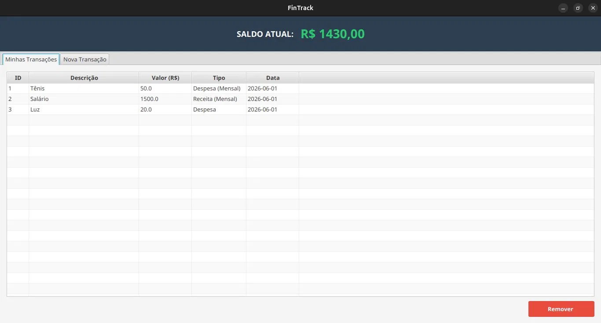
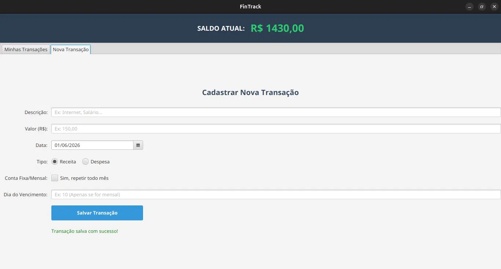

# FinTrack — Controle de Finanças Pessoais

> Sistema de controle de finanças pessoais desenvolvido em Java, evoluindo progressivamente de uma aplicação console até uma interface gráfica com banco de dados persistente.


---

## Sobre o Projeto

O **FinTrack** nasceu como um projeto de estudos de Java com foco em boas práticas de POO. O objetivo é construir, de forma incremental, um sistema completo de controle de finanças pessoais — começando por uma versão funcional via console e evoluindo até uma interface gráfica com persistência em banco de dados.

---

## Screenshots

|                Minhas Transações                 |                Nova Transação                |
|:------------------------------------------------:|:--------------------------------------------:|
|  |  |

---
## Roadmap de Versões

| Versão | Nome | Status | Tecnologias |
|--------|------|--------|-------------|
| v1 | Console | ✅ Concluída | Java puro, POO, Collections, Exceções |
| v2 | Interface Gráfica + Banco de Dados | ✅ Concluída  | JavaFX, FXML, JDBC, SQLite, JUnit 5 |

---

## Versão 1 — Console

### Estrutura de pacotes

```
fintrack/
├── app/          # Ponto de entrada — menu e execução
├── controller/   # Lógica principal de gerenciamento
├── model/        # Transacao, TransacaoMensal
├── exceptions/   # Exceções personalizadas
└── utils/        # Utilitários de formatação
```

---

## Versão 2 — Interface Gráfica + Banco de Dados

### Estrutura de pacotes

```
fintrack/
├── app/          # Ponto de entrada JavaFX
├── controller/   # TransacaoController
├── model/        # Transacao, TransacaoMensal
├── dao/          # TransacaoDAO, Conexao (JDBC)
├── repository/   # RepositorioGenerico<T>
├── exceptions/   # Exceções personalizadas
├── utils/        # Utilitários
├── resources/    # fxml/, css/
└── test/         # Testes JUnit 5
```

---

## Tecnologias

| Tecnologia | Finalidade |
|------------|------------|
| Java 17+ | Linguagem principal |
| JavaFX 17+ | Interface gráfica (v2) |
| SQLite + JDBC | Persistência (v2) |
| JUnit 5 | Testes unitários (v2) |
| Scene Builder | Design de telas FXML (v2) |

---

## Objetivos de Aprendizado

- [x] POO — encapsulamento, herança, polimorfismo
- [x] Coleções Java e tratamento de exceções
- [x] Generics e curingas
- [x] Interfaces gráficas com JavaFX e FXML
- [x] Acesso a banco de dados com JDBC
- [x] Testes unitários com JUnit 5

---
## Como Executar o Projeto

1. Clone o repositório para sua máquina.
2. Abra o seu gerenciador MySQL e execute o script `db.sql` para criar o banco e as tabelas.
3. Na raiz do projeto, duplique o arquivo `.env.exemplo` e renomeie a cópia para apenas `.env`.
4. Abra o arquivo `.env` e coloque o usuário e senha do seu MySQL local.
5. Execute o projeto através da classe `FinApp.java`.

---
## Autor

Desenvolvido por **Gabriel P dos Santos** como projeto de portfólio durante o aprendizado de Java.

[](https://linkedin.com/in/gabrielPdoSantos)
[](https://github.com/GabrielPdoSantos)

---

## Licença

Este projeto está sob a licença MIT.

---
_Ânimo._
